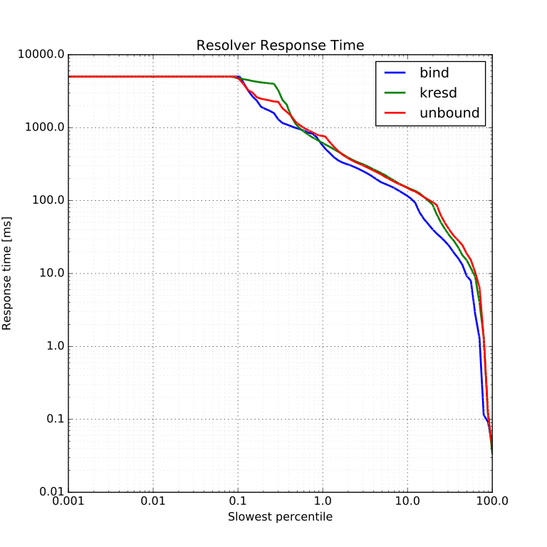

Histogram
=========

Usage
-----

.. code-block:: console

   $ ./histogram.py "${DIR}"    # basic example
   $ ./histogram.py --help      # for more info

Description
-----------

``histogram.py`` uses the latency data of all answers from each server to plot
a graph that can be used to analyze the performance of the servers.

The type of graph this tool generates is the
`logarithmic percentile histogram <https://blog.powerdns.com/2017/11/02/dns-performance-metrics-the-logarithmic-percentile-histogram/>`_.
See the link for full explanation of this graph and the reasoning why it's
suitable to use for benchmarking.

Reading the graph
-----------------

On the horizontal axis, you can read how many percent of queries were answered
*slower* than the corresping response time on the vertical axis.

In other words, the 1.0 slowest percentile means that 99 % of queries were
answered faster than the response time of this percentile. Please note both
axis are logarithmic.

Keep in mind you have to have a large sample of queries to get any meaningful
data for the lower slowest percentiles. The curve also typically flattens out for the slowest queries due to a configured *timeout*.

Notes
-----

* You can specify various image file extensions in the ``--output`` argument to
  generate different image formats.
