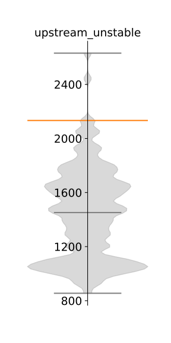
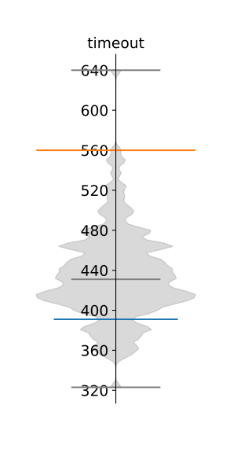
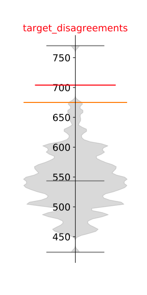
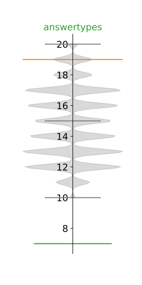
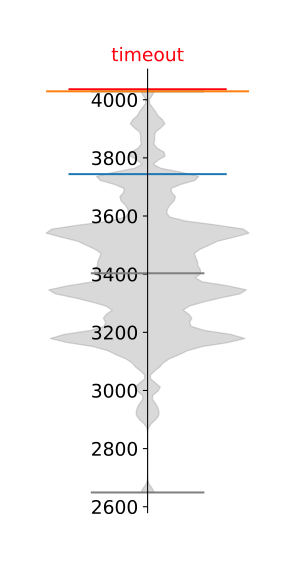

Statcmp
=======

Usage
-----

.. code-block:: console

   $ ./statcmp.py -s stats.json                              # plot statistics
   $ ./statcmp.py -s stats.json -c respdiff.cfg report.json  # plot report comparison
   $ ./statcmp.py --help                                     # for more info

Description
-----------

Plots statistics from ``stats.json`` and optionally compares given reports to
those statistics.

Multiple reports can be compared against the statistical data at the same time.
If any upper threshold is exceeded during comparison, the resulting exit code
will be non-zero.

Violin graph
------------

The generated plots contain so called violin graphs. The "body" (gray) of these graphs is basically a flipped histogram. It shows how frequently the displayed values appear in the given statistical sample.

There are 3 gray boundaries on each graph - minimum, median and maximum. The orange bondary represents the selected upper boundary against which reports are compared against.

If a report is given, there are three possible outcomes. If the field falls within minimum and selected upper boundary, it is drawn blue.

If the field value exceeds the selected upper boundary, it is drawn red and highlighted. These cases should be examined and usually represent a detected issue.

If the field value falls below the known minumum, it is drawn green and highlighted. These signify a possible improvement.

When multiple reports are given for comparison, a line is drawn for each sample.

Utility scripts
---------------

TODO
